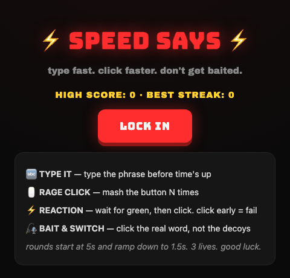

# ⚡ Speed Says

A browser-based reflex game where every round could be a trap. Type fast, mash faster, react on cue, and don't fall for the bait — all while the clock ramps from 5 seconds down to 1.5.

**[▶ Play it live](https://sidharthjoly.github.io/speed-says/)** — installable as a PWA, and works offline once loaded.



## How it plays

Five round types, shuffled at random, timer shrinking every round:

| Round | What you do |
|---|---|
| 🔤 **Type It Fast** | Type the phrase on screen before time runs out |
| 🖱️ **Rage Click** | Mash a button a set number of times before the clock hits zero |
| ⚡ **Reaction** | Wait for the signal to turn green, then click — click early and you're out |
| 🎣 **Bait & Switch** | Click the exact word among near-identical lookalikes |
| 🗣️ **Speed Says** | Only press the button when the prompt starts with "SPEED SAYS" — a classic Simon Says trap |

Three lives, scoring rewards speed and streaks (up to a 2x multiplier at a 10-round streak), and every 5-streak triggers a combo callout. High score, best streak, and your last 5 runs are saved locally so you can chase your own record.

## Tech

Zero dependencies, zero build step — plain HTML, CSS, and JavaScript, playable straight off disk or any static host.

- Round timing and animation via `requestAnimationFrame`
- Sound effects synthesized at runtime with the Web Audio API (no audio files)
- Pointer events (not `click`) for low-latency mobile taps, plus haptic feedback via the Vibration API
- Game state, high scores, streaks, and run history persisted with `localStorage`
- Installable PWA: a manifest + service worker cache the app shell so it works fully offline after the first load

## Run it locally

No build step required — just serve the folder:

```bash
git clone https://github.com/SidharthJoly/speed-says.git
cd speed-says
python3 -m http.server 8765
```

Then open `http://localhost:8765`.

## Project structure

```
index.html      markup for the three screens (start, game, game over)
style.css       theme, layout, and animations
script.js       game loop, round logic, audio engine, and persistence
manifest.json   PWA manifest
sw.js           service worker: caches the app shell for offline play
icons/          app icons (incl. maskable) generated from the theme's bolt mark
```

## License

MIT — see [LICENSE](LICENSE).
